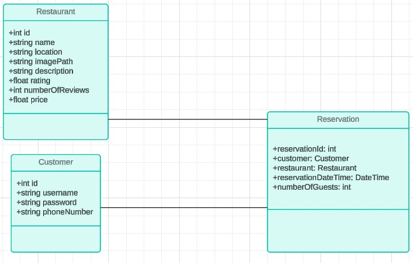

# Class Diagram 1: **Reservation System Entities**

## Description:
This class diagram illustrates the main entities involved in the **BookNow reservation system**, including `Customer`, `Restaurant`, and `Reservation`. 
Each class represents a key entity in the system and contains attributes that define their properties. The relationships between these entities are represented with association lines.

- **Customer**: Represents the user of the system who can create reservations and log in. The attributes include `id`, `username`, `password`, and `phoneNumber`.
- **Restaurant**: Represents the restaurant where reservations can be made. The attributes include `id`, `name`, `location`, `imagePath`, `description`, `rating`, `numberOfReviews`, and `price`.
- **Reservation**: Represents a reservation made by a `Customer` at a `Restaurant`. The attributes include `reservationId`, `customer` (linking to a `Customer`), `restaurant` (linking to a `Restaurant`), `reservationDateTime`, and `numberOfGuests`.

## Diagram:

This diagram showcases how customers, restaurants, and reservations interact in the system. Each `Reservation` is linked to a specific `Customer` and `Restaurant`, reflecting the relationships between the entities in the application.

---

# Class Diagram 2: **Reservation System (MVC Architecture)**

## Description:
This class diagram extends the **BookNow reservation system** to follow the **Model-View-Controller (MVC)** architecture. The system is now composed of three main layers: **Models**, **Views**, and **Controllers**.

### **Models**:
The **Model** layer represents the entities of the system. This layer includes the following classes:
- **Customer**: Represents the user of the system with attributes `id`, `username`, `password`, and `phoneNumber`.
- **Restaurant**: Represents a restaurant where reservations are made. Attributes include `id`, `name`, `location`, `imagePath`, `description`, `rating`, `numberOfReviews`, and `price`.
- **Reservation**: Represents a reservation made by a `Customer` at a `Restaurant`. Attributes include `reservationId`, `customer`, `restaurant`, `reservationDateTime`, and `numberOfGuests`.

### **Views**:
The **View** layer represents the user interface (UI) of the system. In this case, the views are defined using JavaFX and FXML files:
- **Login_View**: The view that allows users to log in.
- **CreateAccount_View**: The view where new users create an account.
- **BookNow_View**: The main view for searching restaurants and creating reservations.

### **Controllers**:
The **Controller** layer handles the user interaction and acts as a mediator between the **View** and the **Model**. Each controller listens to events in the UI and updates the model accordingly:
- **LoginController**: Handles the login process and user authentication.
- **CreateAccountController**: Manages the account creation process.
- **BookNowController**: Handles the restaurant search and reservation creation.

## Diagram:

This extended diagram illustrates the interaction between models, views, and controllers. Each **View** sends user events to its corresponding **Controller**, which in turn interacts with the **Models** to retrieve or update data. The controllers manage the flow of data between the UI and the backend entities.

---

### Example: Interaction Flow
- When a user logs in, the **Login_View** sends the credentials to the **LoginController**, which authenticates the user by checking the credentials against the **Customer** model.
- When a user searches for restaurants, the **BookNow_View** sends the search criteria to the **BookNowController**, which fetches data from the **Restaurant** model and displays the results in the view.

This layered architecture ensures separation of concerns and provides a clean structure for managing user interactions and business logic.
