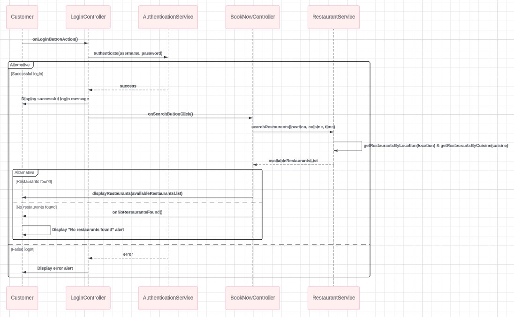

## Class Diagram 1: **Reservation System Entities**

### Description:
This class diagram illustrates the main entities involved in the **BookNow reservation system**, including `Customer`, `Restaurant`, and `Reservation`. Each class represents a key entity in the system, containing attributes that define their properties and methods for interacting with those properties.

---

#### 1. **Customer**
- **Description**: Represents a user of the system who can create reservations and log in.
- **Attributes**:
    - `String username`: The username of the customer.
    - `String password`: The password of the customer.
- **Constructor**:
    - `Customer(String username, String password)`: Initializes a new `Customer` object with the provided username and password.
- **Methods**:
    - `getUsername()`: Returns the username of the customer.
    - `setUsername(String username)`: Sets the username of the customer.
    - `getPassword()`: Returns the password of the customer.
    - `setPassword(String password)`: Sets the password of the customer.

---

#### 2. **Restaurant**
- **Description**: Represents a restaurant where customers can make reservations.
- **Attributes**:
    - `String name`: The name of the restaurant.
    - `String location`: The location of the restaurant.
    - `float rating`: The rating of the restaurant (on a scale from 1 to 5).
    - `float price`: The price range of the restaurant.
- **Constructor**:
    - `Restaurant(String name, String location, float rating, float price)`: Initializes a new `Restaurant` object with the provided name, location, rating, and price.
- **Methods**:
    - `getName()`: Returns the name of the restaurant.
    - `setName(String name)`: Sets the name of the restaurant.
    - `getLocation()`: Returns the location of the restaurant.
    - `setLocation(String location)`: Sets the location of the restaurant.
    - `getRating()`: Returns the rating of the restaurant.
    - `setRating(float rating)`: Sets the rating of the restaurant.
    - `getPrice()`: Returns the price range of the restaurant.
    - `setPrice(float price)`: Sets the price range of the restaurant.

---

#### 3. **Reservation**
- **Description**: Represents a reservation made by a customer at a restaurant for a specific date and time.
- **Attributes**:
    - `Customer customer`: The customer who made the reservation.
    - `Restaurant restaurant`: The restaurant where the reservation is made.
    - `LocalDateTime reservationDateTime`: The date and time of the reservation.
    - `int numberOfGuests`: The number of guests for the reservation.
- **Constructor**:
    - `Reservation(Customer customer, Restaurant restaurant, LocalDateTime reservationDateTime, int numberOfGuests)`: Initializes a new `Reservation` object with the provided customer, restaurant, reservation date and time, and the number of guests.
- **Methods**:
    - `getCustomer()`: Returns the customer associated with the reservation.
    - `setCustomer(Customer customer)`: Sets the customer for the reservation.
    - `getRestaurant()`: Returns the restaurant associated with the reservation.
    - `setRestaurant(Restaurant restaurant)`: Sets the restaurant for the reservation.
    - `getReservationDateTime()`: Returns the date and time of the reservation.
    - `setReservationDateTime(LocalDateTime reservationDateTime)`: Sets the date and time of the reservation.
    - `getNumberOfGuests()`: Returns the number of guests for the reservation.
    - `setNumberOfGuests(int numberOfGuests)`: Sets the number of guests for the reservation.

---

# Class Diagram 2: Reservation System (MVC Architecture)

## Description:
This class diagram extends the **BookNow reservation system** to follow the **Model-View-Controller (MVC)** architecture. The system is structured with three primary layers: **Models**, **Views**, and **Controllers**.

### **Models**:
The **Model** layer represents the core entities of the system. This layer contains the following classes:

---

#### 1. **Customer**
- **Attributes**:
    - `String username`: The username of the customer.
    - `String password`: The password of the customer.
- **Constructor**:
    - `Customer(String username, String password)`: Initializes a new `Customer` object with the provided username and password.
- **Methods**:
    - `getUsername()`: Returns the username of the customer.
    - `setUsername(String username)`: Sets the username of the customer.
    - `getPassword()`: Returns the password of the customer.
    - `setPassword(String password)`: Sets the password of the customer.
---

#### 2. **Restaurant**
- **Attributes**:
    - `String name`: The name of the restaurant.
    - `String location`: The location of the restaurant.
    - `float rating`: The rating of the restaurant (on a scale from 1 to 5).
    - `float price`: The price range of the restaurant.
- **Constructor**:
    - `Restaurant(String name, String location, float rating, float price)`: Initializes a new `Restaurant` object with the provided name, location, rating, and price.
- **Methods**:
    - `getName()`: Returns the name of the restaurant.
    - `setName(String name)`: Sets the name of the restaurant.
    - `getLocation()`: Returns the location of the restaurant.
    - `setLocation(String location)`: Sets the location of the restaurant.
    - `getRating()`: Returns the rating of the restaurant.
    - `setRating(float rating)`: Sets the rating of the restaurant.
    - `getPrice()`: Returns the price range of the restaurant.
    - `setPrice(float price)`: Sets the price range of the restaurant.

---

#### 3. **Reservation**
- **Attributes**:
    - `Customer customer`: The customer who made the reservation.
    - `Restaurant restaurant`: The restaurant where the reservation is made.
    - `LocalDateTime reservationDateTime`: The date and time of the reservation.
    - `int numberOfGuests`: The number of guests for the reservation.
- **Constructor**:
    - `Reservation(Customer customer, Restaurant restaurant, LocalDateTime reservationDateTime, int numberOfGuests)`: Initializes a new `Reservation` object with the provided customer, restaurant, reservation date and time, and the number of guests.
- **Methods**:
    - `getCustomer()`: Returns the customer associated with the reservation.
    - `setCustomer(Customer customer)`: Sets the customer for the reservation.
    - `getRestaurant()`: Returns the restaurant associated with the reservation.
    - `setRestaurant(Restaurant restaurant)`: Sets the restaurant for the reservation.
    - `getReservationDateTime()`: Returns the date and time of the reservation.
    - `setReservationDateTime(LocalDateTime reservationDateTime)`: Sets the date and time of the reservation.
    - `getNumberOfGuests()`: Returns the number of guests for the reservation.
    - `setNumberOfGuests(int numberOfGuests)`: Sets the number of guests for the reservation.

---

### **Views**:
The **View** layer consists of the user interface (UI) for interacting with the system. These are defined using JavaFX and FXML files:
- **LoginView**: The UI for users to log in.
- **CreateAccountView**: The UI for new users to create an account.
- **BookNowView**: The main UI where users search for restaurants and create reservations.
- **RestaurantDetailsView**: The UI for displaying detailed information about a selected restaurant.

---

### **Controllers**:
The **Controller** layer acts as the intermediary between the views and models. Each controller listens to events in the UI, interacts with the models, and updates the view:

1. **LoginController**:
    - **Fields**:
        - `TextField tf_username`: Input field for the username.
        - `PasswordField pf_password`: Input field for the password.
        - `AuthenticationService authenticationService`: Service for handling authentication logic.
    - **Methods**:
        - `onLoginButtonAction()`: Handles the login button click event. Validates input and calls `AuthenticationService` to authenticate the user.
        - `validateInput()`: Validates that both the username and password fields are filled in.
        - `handleLoginResult(boolean isAuthenticated)`: Displays either a success or error alert based on whether the authentication was successful or not.

2. **CreateAccountController**:
    - **Fields**:
        - `TextField tf_Username`: Input field for the username.
        - `PasswordField pf_Password`: Input field for the password.
        - `PasswordField pf_ConfirmPassword`: Input field for confirming the password.
        - `CustomerService customerService`: Service for handling customer-related operations.
    - **Methods**:
        - `onCreateAccountButtonAction()`: Handles the "Create New Account" button click event. Validates input, checks for existing usernames, and creates a new account if all conditions are met.
        - `onButton_Login()`: Handles the "Log in" button click event. Provides a placeholder for redirecting to the login view.
        - `loadLoginView()`: Placeholder method for loading the login view after successful account creation.

3. **BookNowController**:
    - **Fields**:
        - `Label lbl_welcome`: Displays the welcome message.
        - `ComboBox<String> locationComboBox`: Dropdown for selecting the restaurant location.
        - `ComboBox<String> cb_cuisineType`: Dropdown for selecting the type of cuisine.
        - `ComboBox<String> cb_rating`: Dropdown for selecting restaurant rating.
        - `ComboBox<String> cb_priceRange`: Dropdown for selecting the price range.
        - `DatePicker checkInDate`: Date picker for selecting the reservation date.
        - `Button guestButton`: Button to open guest selection options.
        - `VBox restaurantListVBox`: Container for displaying the list of restaurants.
        - `VBox guestSelectionVBox`: Container for selecting the number of adults and children.
        - `Label adultsLabel`: Displays the number of adults.
        - `Label childrenLabel`: Displays the number of children.
        - `VBox availabilityVBox`: Container for displaying available times for reservations.
        - `Button leaveReviewButton`: Button to leave a review for the restaurant.
        - `ComboBox<Restaurant> restaurantComboBox`: Dropdown for selecting a restaurant.
        - `VBox reservationHistoryVBox`: Container for displaying reservation history.
        - `TextArea reviewTextArea`: Text area for entering a review.
        - `ComboBox<String> cb_reviewRating`: Dropdown for selecting a review rating.
        - `ComboBox<String> cb_reservationToCancel`: Dropdown for selecting a reservation to cancel.
        - `RestaurantService restaurantService`: Service for handling restaurant-related logic.
        - `ReservationService reservationService`: Service for handling reservation-related logic.
    - **Methods**:
        - `onGuestButtonAction()`: Opens the guest selection popup.
        - `onSearchButtonClick()`: Fetches and displays restaurants based on the selected filters.
        - `onNoRestaurantsFound()`: Displays an alert if no restaurants match the search criteria.
        - `onRestaurantSelected()`: Handles restaurant selection and fetches available times.
        - `onConfirmReservation()`: Confirms the reservation and records it.
        - `onViewReservationHistory()`: Fetches and displays past reservations for the customer.
        - `onSubmitReview()`: Handles submitting a review for a selected restaurant.
        - `onCancelReservation()`: Handles the cancellation of a reservation.
        - `increaseAdults()`: Increases the count of adults.
        - `decreaseAdults()`: Decreases the count of adults.
        - `increaseChildren()`: Increases the count of children.
        - `decreaseChildren()`: Decreases the count of children.
        - `displaySearchRestaurants(List<Restaurant> availableRestaurants)`: Displays the list of searched restaurants in the UI.
        - `displayRestaurantDetails(Restaurant restaurant)`: Displays the detailed information for the selected restaurant.

### **Services**:
The system uses services to manage business logic and interaction with the models:

1. **AuthenticationService**:
    - **Methods**:
        - `authenticate(String username, String password)`: Authenticates a user by checking their credentials against the database.
            - Establishes a connection to the database.
            - Executes an SQL query to find a user with the provided username and password.
            - Returns `true` if a matching user is found, `false` if not.
        - The method also includes error handling to manage database connection failures.

2. **CustomerService**:
    - **Fields**:
        - `List<Customer> customerDatabase`: A simulated in-memory database that stores a list of customers.
    - **Methods**:
        - `addCustomer(Customer customer)`: Adds a new customer to the simulated database after verifying that the username is not already taken.
        - `isUsernameTaken(String username)`: Checks if the provided username already exists in the customer database.

3. **ReservationService**:
    - **Methods**:
        - `confirmReservation(Reservation reservation)`: Confirms and records a reservation with details such as customer, restaurant, and time.
        - `getReservationsByCustomer(Customer customer)`: Fetches the list of reservations made by a specific customer.
        - `getAvailableTimes(Restaurant restaurant)`: Retrieves the available reservation time slots for a specific restaurant.
        - `cancelReservation(String reservationId)`: Cancels an existing reservation based on the provided reservation ID.

4. **RestaurantService**:
    - **Methods**:
        - `getRestaurantsByLocation(String location)`: Retrieves a list of restaurants based on their location.
        - `getRestaurantsByCuisine(String cuisine)`: Fetches a list of restaurants based on their cuisine type.
        - `getRestaurantsByRating(int rating)`: Retrieves a list of restaurants based on their rating.
        - `getRestaurantsByPriceRange(String priceRange)`: Fetches a list of restaurants based on their price range.
        - `searchRestaurants(String location, String cuisine, String time)`: Searches and returns a list of restaurants based on location, cuisine type, and reservation time.
        - `submitReview(Restaurant restaurant, String review, int rating)`: Allows users to submit a review for a restaurant, recording their rating and review content.

---

### **Utilities**:
Utilities are responsible for handling shared services, such as alerting users and managing the database connection.

1. **Alerts**
    - **Methods**:
        - `showInfoAlert(String title, String message): void` - Displays an informational alert with the specified title and message.
        - `showErrorAlert(String title, String message): void` - Displays an error alert with the specified title and message.
        - `showAlert(Alert.AlertType alertType, String title, String message): void` - A general method to show an alert of a specific type (INFORMATION or ERROR) with the given title and message.

2. **DatabaseConnection**
    - **Attributes**:
        - `url: String` - URL of the database.
        - `username: String` - Username for the database.
        - `password: String` - Password for the database.
    - **Methods**:
        - `connect(): Connection` - Establishes a connection to the database.

### Diagram:

This diagram illustrates the relationships between models, views, controllers, services, and utilities. Each **View** sends user input to its corresponding **Controller**, which processes the input, interacts with the **Models** via the **Services**, and updates the **View** accordingly. The **DatabaseConnection** utility ensures that all interactions with the database are centralized and managed securely.

---

### Example: Interaction Flow

1. **User Authentication Flow**:
    - **Step 1**: If the user is a new user:
        - The user navigates to the **CreateAccountView** and enters their desired username and password.
        - The **CreateAccountController** calls `onCreateAccountButtonAction()` to validate the input.
        - If the username is available and the password meets requirements, the account is created using `addCustomer(Customer customer)` from the **CustomerService**.
        - The user is then automatically logged in and redirected to the **BookNowView**.
    - **Step 2**: If the user is an existing user:
        - The user navigates to the **LoginView** and enters their username and password.
        - The **LoginController** calls `onLoginButtonAction()` to validate the credentials using `authenticate(String username, String password)` from the **AuthenticationService**.
        - If the credentials are valid, the user is redirected to the **BookNowView**.
        - If the credentials are invalid, an error alert is displayed using the **Alerts** utility, prompting the user to re-enter their credentials.

2. **Restaurant Search and Reservation Flow**:
    - **Step 1**: In the **BookNowView**, the user enters search criteria, such as location, cuisine type, and the number of guests.
    - **Step 2**: The user clicks the search button, triggering the **BookNowController** to call `onSearchButtonClick()`.
    - **Step 3**: The **BookNowController** uses the search filters and interacts with the **RestaurantService** to retrieve a list of matching restaurants by calling `searchRestaurants(location, cuisine, time)`.
    - **Step 4**: The matching restaurants are displayed in the **BookNowView**, showing the available reservation times and details about each restaurant.
    - **Step 5**: The user selects a restaurant from the list to view more details, which triggers `displayRestaurantDetails(Restaurant restaurant)` in the **BookNowController**.
    - **Step 6**: The **BookNowController** fetches the restaurant details and updates the **RestaurantDetailsView** with information such as the menu, operating hours, and customer reviews.
    - **Step 7**: The user proceeds to choose a date and time for the reservation.
    - **Step 8**: The **BookNowController** calls `onConfirmReservation()` to confirm the reservation, interacting with the **ReservationService** as needed.
    - **Step 9**: After confirming the reservation, a success message is displayed to the user.

3. **Cancel Reservation Flow**:
    - **Step 1**: The user selects a future reservation from their options in the **BookNowView**.
    - **Step 2**: The user clicks the "Cancel Reservation" button, triggering the **BookNowController** to call `onCancelReservation()`.
    - **Step 3**: The **ReservationService** is invoked to cancel the selected reservation.
    - **Step 4**: If the cancellation is successful, the **BookNowView** is updated to reflect the cancellation, and a success message is shown to the user.

4. **Review Flow**:
    - **Step 1**: After attending a reservation, the user is prompted to leave a review in the **BookNowView**.
    - **Step 2**: The user writes their review and selects a rating for the restaurant.
    - **Step 3**: The **BookNowController** interacts with the **RestaurantService** to submit the review and rating by calling `submitReview(restaurant, review, rating)`.
    - **Step 4**: Once submitted, the **BookNowView** displays a confirmation, and the restaurant's overall rating is updated in the system.

### Adherence to MVC Principles:
1. **Separation of Concerns**:
- The system is divided into distinct layers (Model, View, Controller), each handling a specific part of the system logic.
2. **High Cohesion, Low Coupling**:
- The components are cohesive and interact minimally with one another. The Views are separate from the Models, and all interactions occur through the Controllers.
3. **Controller as the Mediator**:
- All communication between Views and Models occurs via the Controllers, ensuring modularity and easy updates.

# Sequence Diagram for Customer Login and Restaurant Search

## Overview
This sequence diagram illustrates the use case where a customer logs in and searches for restaurants. It captures the flow of messages and interactions between the system components, demonstrating how different classes work together to fulfill this functionality.

## Use Case
The following steps outline the process for logging in and searching for restaurants:
1. **Customer initiates login** by clicking the login button (`onLoginButtonAction()`).
2. **Login processing and validation** occurs in the `AuthenticationService` via the `authenticate(username, password)` method.
3. If login is successful, the **LoginController** triggers the restaurant search by calling `onSearchButtonClick()` in the **BookNowController**.
4. The **Customer** selects search criteria (location, cuisine, time).
5. The **BookNowController** calls `searchRestaurants(location, cuisine, time)` in the **RestaurantService** to fetch available restaurants based on the selected criteria.
6. The system retrieves matching restaurants and displays the search results to the customer.

## Sequence Diagram

### Participants:
- **Customer**: The user interacting with the application.
- **LoginController**: Handles login functionality and user input.
- **AuthenticationService**: Responsible for validating user credentials.
- **BookNowController**: Manages the main application flow after successful login and handles restaurant searches.
- **RestaurantService**: Handles restaurant data retrieval and filtering based on search criteria.

---

### 1. **LoginController**
- **onLoginButtonAction()**:
    - Handles the login button click event, triggering the login process.
    - Calls `authenticate(username, password)` from `AuthenticationService` to validate the credentials.

### 2. **AuthenticationService**
- **authenticate(String username, String password)**:
    - Validates user credentials by checking them against the database.
    - Returns a boolean indicating success (`true`) or failure (`false`).

### 3. **BookNowController**
- **onSearchButtonClick()**:
    - After a successful login, this method allows the customer to search for restaurants.
    - Calls `RestaurantService.searchRestaurants()` with the customer’s selected search criteria (location, cuisine, time).

- **displayRestaurants(List<Restaurant> availableRestaurantsList)**:
    - This method is responsible for updating the UI with the search results.

### 4. **RestaurantService**
- **searchRestaurants(String location, String cuisine, String time)**:
    - Fetches the list of restaurants matching the selected search criteria.

- **getRestaurantsByLocation(String location)**, **getRestaurantsByCuisine(String cuisine)**:
    - These methods are used internally by `searchRestaurants()` to retrieve restaurants based on specific filters (location and cuisine).

---

## Conclusion
This sequence diagram aligns with the methods and flow described my code. It includes all relevant interactions for **login**, **restaurant search**, and **displaying search results**. The MVC architecture is clearly illustrated, showing how controllers, services, and models collaborate to handle user requests.
