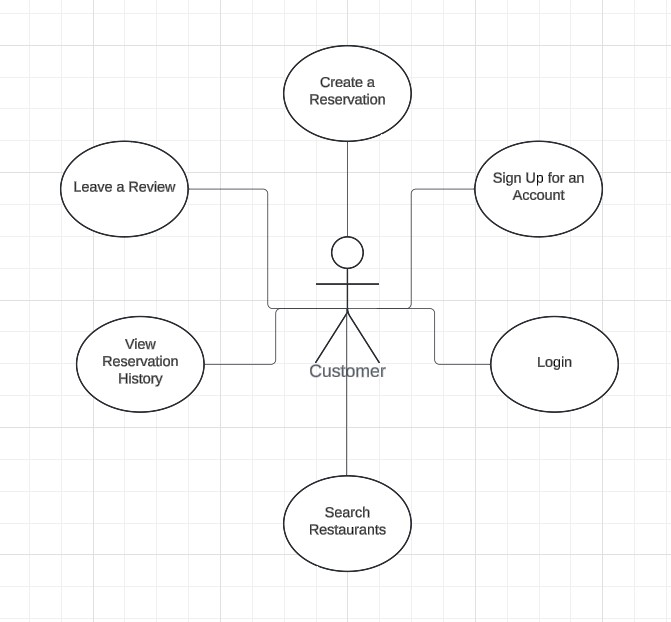

# Entities

## Case Diagram

Entities in the BookNow application I have describes their roles and attributes.

### 1. **Customer**
- **Description**: The `Customer` entity represents a user who can create an account, log in, and make reservations.
- **Attributes**:
    - `id`: The unique identifier for the customer.
    - `username`: The username chosen by the customer for logging in.
    - `password`: The customer's password.
    - `phoneNumber`: Contact information for the customer.

---

### 2. **Restaurant**
- **Description**: The `Restaurant` entity represents a restaurant that users can search for and make reservations, etc.
- **Attributes**:
    - `id`: The unique identifier for the restaurant.
    - `name`: The name of the restaurant.
    - `location`: The restaurant's location.
    - `imagePath`: The path of the restaurant's image (used for display in the application).
    - `description`: Information about the restaurant (e.g., operating hours).
    - `rating`: The restaurant’s overall rating, on a scale from 1 to 5.
    - `numberOfReviews`: The total number of reviews left for the restaurant.
    - `price`: The average price level at the restaurant.

---

### 3. **Reservation**
- **Description**: The `Reservation` entity represents a booking made by a customer at a specific restaurant.
- **Attributes**:
    - `reservationId`: The unique identifier for the reservation.
    - `customer`: The customer who made the reservation.
    - `restaurant`: The restaurant where the reservation is made.
    - `reservationDateTime`: The date and time of the reservation.
    - `numberOfGuests`: The number of guests included in the reservation.

---

