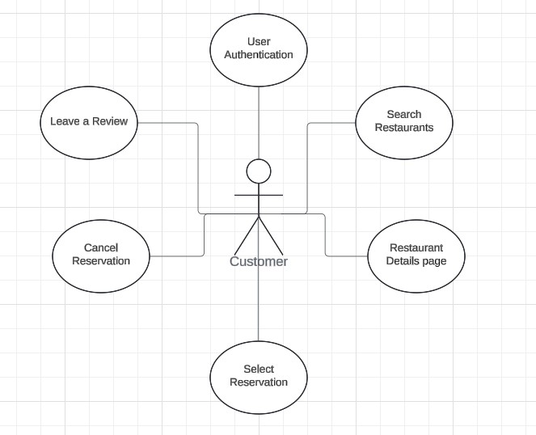

# Requirements

## Use Case Diagram

## Non-Functional Requirements

### Performance
- **Explanation**: The application should quickly return search results and manage user inputs without delay.
- **Implementation**:
    1. Implement database indexing.
    2. Optimize SQL queries to speed up the search for restaurants based on location, cuisine type, and other filters.

### Portability
- **Explanation**: The application should be able to run on different operating systems (Windows, macOS, Linux) without needing significant changes to the codebase.
- **Implementation**:
    1. Leverage Java's "write once, run anywhere" (WORA).
    2. Build the application into an executable JAR to be easily executed on any system with the Java Runtime Environment (JRE) installed.

### Usability
- **Explanation**: The interface will be intuitive and user-friendly, enabling users to quickly navigate the application.
- **Implementation**:
    1. Create a clean, minimalist design.
    2. Add helpful tooltips.
    3. Implement responsive error handling.
    4. Provide user feedback mechanisms.

## Functional Requirements

### **Use Case 1: User Authentication**
- **Actors**: New User, Existing User
- **Use case goal**: Allow users to create new accounts and log in to access the application.
- **Primary Actor**: User
- **Preconditions**:
  - New users must not be registered.
  - Existing users must have valid credentials.
- **Basic flow**:
  1. If the user is a new user:
  - User enters a username and password to create an account.
  - System validates the input and checks for existing usernames.
  - If valid, the user account is created, and the user is automatically logged in.
  2. If the user is an existing user:
  - User enters their username and password.
  - System validates the credentials and logs the user in.
- **Alternative flows**:
  - **Alternative flow 1**: User enters mismatched passwords when creating an account.
  - **Alternative flow 2**: Username is already taken when creating a new account.
  - **Alternative flow 3**: Invalid credentials when logging in.

---

### **Use Case 2: Search Restaurants**
- **Actors**: Customer
- **Use case goal**: Allow customers to search for restaurants based on location, cuisine type, and reservation time.
- **Primary Actor**: Customer
- **Preconditions**: Restaurants must be registered in the database.
- **Basic flow**:
  1. Customer navigates to the search page.
  2. Customer selects filters (location, cuisine, etc.) and submits the search.
  3. System retrieves matching restaurants and displays results.
- **Alternative flows**:
  - **Alternative flow 1**: No restaurants match the search criteria.
  - **Alternative flow 2**: Missing or invalid input prompts an error message.

---

### **Use Case 3: Restaurant Details Page**
- **Actors**: Customer
- **Use case goal**: Allow users to view detailed information about a selected restaurant.
- **Primary Actor**: Customer
- **Preconditions**: Restaurant must be registered in the database.
- **Basic flow**:
  1. Customer selects a restaurant from the search results.
  2. System displays the restaurant's details, including menu, operating hours, and customer reviews.
- **Alternative flows**:
  - **Alternative flow 1**: The selected restaurant has no available information (e.g., menu or reviews not found).

---

### **Use Case 4: Select Reservation**
- **Actors**: Customer
- **Use case goal**: Allow customers to select a reservation time for a chosen restaurant.
- **Primary Actor**: Customer
- **Preconditions**: Customer must be logged in, and restaurant availability must be known.
- **Basic flow**:
  1. Customer selects a restaurant and picks an available reservation time.
  2. System confirms the reservation and sends a confirmation to the customer.
- **Alternative flows**:
  - **Alternative flow 1**: Customer cancels the reservation process.
  - **Alternative flow 2**: Selected time slot is unavailable; the system suggests alternative slots.

---
### **Use Case 5: Cancel Reservation**
- **Actors**: Customer
- **Use case goal**: Enable customers to cancel existing reservations.
- **Primary Actor**: Customer
- **Preconditions**: A valid reservation must exist.
- **Basic flow**:
  1. Customer selects a future reservation.
  2. Customer cancels the reservation.
  3. System updates the reservation status.
- **Alternative flows**:
  - **Alternative flow 1**: Reservation is not cancellable (e.g., within a restricted time window).
  
---

### **Use Case 6: Leave a Review**
- **Actors**: Customer
- **Use case goal**: Enable customers to leave reviews for restaurants they have visited.
- **Primary Actor**: Customer
- **Preconditions**: Customer must have made a reservation.
- **Basic flow**:
  1. Customer selects a past reservation.
  2. Customer submits a review and rating for the restaurant.
  3. System saves the review and updates the restaurant’s rating.
- **Alternative flows**:
  - **Alternative flow 1**: The customer cancels before submitting the review.

---
