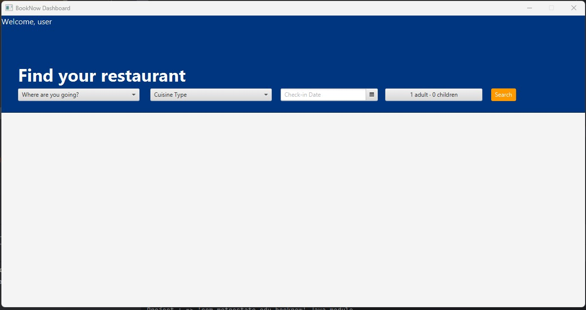

## Wireframes

### 1. **Login Wireframe**

**Description**:  
This is the login screen it will be the screen that first pops up when application runs. It includes:
- The "BookNow" title with a tagline encouraging users to discover and reserve tables at the best restaurants.
- A form on the right with fields for entering a username and password.
- A "Login" button for submitting login credentials.
- A "Forgot Password?" link for users who need to reset their password. However this will not work I implement this just for looks.
- A "Create New Account" button for users who haven't signed up yet.

---

### 2. **Create New Account Wireframe**

**Description**:  
This screen allows new users to create an account. It features:
- The "BookNow" title with a tagline encouraging users to discover and reserve tables at the best restaurants.
- A form on the right side of the screen with fields for entering a username, password, and confirming the password.
- A "Create New Account" button for users to submit the form.
- A "Log in" button that takes the user back to the login screen.

### 3. **BookNow Dashboard Wireframe**

**Description**:  
This is the main dashboard screen that users see after logging in. It allows users to search for restaurants by location, cuisine type, and check-in date. The screen has the following components:
- A welcome message for the user at the top left.
- Dropdown menus for selecting a location and cuisine type.
- A date picker for selecting a check-in date.
- A guest selection option to choose the number of adults and children.
- A "Search" button to trigger the restaurant search process.
- Below that is where the list of restaurants will appear after users filled in the fields.
  The layout is divided into a blue upper section where all search options are displayed, and a white lower section where search results will be shown.

---

These wireframes guide the user flow from creating an account to logging in and searching for restaurants.
